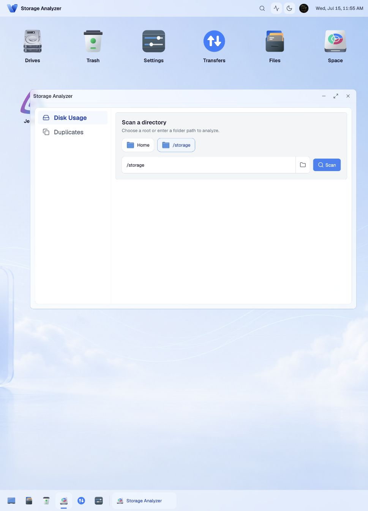

<p align="center">
  
</p>

# Volum

Volum is a self-hosted, desktop-style file manager for home servers and Docker
hosts. Browse files, manage drives and Trash, share files, and inspect storage
from a familiar browser workspace.

Copy, move, upload, archive, extract, checksum, trash, restore, disk analysis,
and duplicate scans run as persistent server jobs. Closing the browser does not
stop the operation.

<p align="center">
  
</p>

## Quick Start

You only need Docker.

```sh
mkdir -p volum/data volum/storage
cd volum

docker run -d \
  --name volum \
  --restart unless-stopped \
  -p 127.0.0.1:8090:8090 \
  -v "$PWD/data:/data" \
  -v "$PWD/storage:/storage" \
  -e VOLUM_ROOTS=/storage \
  -e VOLUM_DB=/data/volum.db \
  -e VOLUM_AUTH_REQUIRED=false \
  -e VOLUM_ALLOW_INSECURE_AUTH_DISABLED=true \
  ghcr.io/shirishkoirala/volum:latest
```

Open [http://localhost:8090](http://localhost:8090).

The quick-start stack:

- stores files in `./storage`
- stores the SQLite database in `./data`
- binds only to localhost
- disables authentication for local evaluation

Stop it with:

```sh
docker stop volum
docker rm volum
```

> The quick start is for local evaluation. Use the authenticated server setup
> before exposing Volum to a LAN, reverse proxy, or the internet.

## Server Setup

Start with the authenticated server configuration:

```sh
git clone https://github.com/shirishkoirala/volum.git
cd volum
cp .env.server.example .env
openssl rand -base64 32
```

Paste the generated value into `VOLUM_SESSION_SECRET` in `.env`, review the
storage mount and allowed hosts, then start Volum:

```sh
docker compose -f docker-compose.server.yml up --build -d
```

Open [http://localhost:8090](http://localhost:8090). On first run, create the
admin account using `VOLUM_BOOTSTRAP_TOKEN`. If that variable is empty, Volum
generates a token file beside the database and logs its path.

Keep `VOLUM_HOST_PATH=./storage` until broader host access is genuinely needed.
For a reverse proxy or remote access, also configure `VOLUM_PUBLIC_URL` and
`VOLUM_ALLOWED_HOSTS`.

See the [configuration reference](docs/configuration.md) and
[reverse-proxy guide](docs/reverse-proxy.md) before production deployment.

## Development Start

The supported development environment runs entirely through Docker; Go and
Node.js are optional on the host.

```sh
git clone https://github.com/shirishkoirala/volum.git
cd volum
make setup
make dev
```

Open [http://localhost:8342](http://localhost:8342). The API is available at
[http://localhost:8090](http://localhost:8090), and frontend changes reload
automatically.

Use disposable test files under `storage/`. Authentication is enabled in the
development stack, so follow the first-run setup screen when starting with an
empty database.

Useful commands:

| Command              | Purpose                                      |
| -------------------- | -------------------------------------------- |
| `make help`          | List supported workflows                     |
| `make dev-detached`  | Start development services in the background |
| `make check`         | Run required frontend and backend checks     |
| `make test-frontend` | Run the frontend test suite                  |
| `make test-backend`  | Run backend tests through Docker             |
| `make build`         | Build the production image                   |
| `make smoke`         | Run the authenticated smoke test             |
| `make smoke-proxy`   | Test uploads through a reverse proxy         |
| `make stop`          | Stop the development stack                   |

Read [CONTRIBUTING.md](CONTRIBUTING.md) for repository structure, conventions,
and focused change guides.

## What You Can Do

- Browse large folders with incremental loading, grid and list views, search,
  previews, favorites, and keyboard shortcuts.
- Run reliable copy, move, upload, archive, extract, checksum, Trash, and restore
  operations with progress, retry, pause, resume, and conflict handling.
- Analyze disk usage down to individual files and find exact duplicate content.
- Create expiring share links with optional passwords and download limits.
- Manage drives, desktop shortcuts, wallpapers, services, notifications, users,
  and database maintenance.
- Use the responsive desktop on touch devices and narrow screens.

<p align="center">
  
</p>

## Documentation

- [Configuration](docs/configuration.md)
- [Reverse proxy](docs/reverse-proxy.md)
- [Architecture](docs/architecture.md)
- [Roadmap](docs/roadmap.md)
- [Release process](docs/release.md)
- [Support](SUPPORT.md)
- [Security](SECURITY.md)

## License

Volum is released under the [MIT License](LICENSE).
