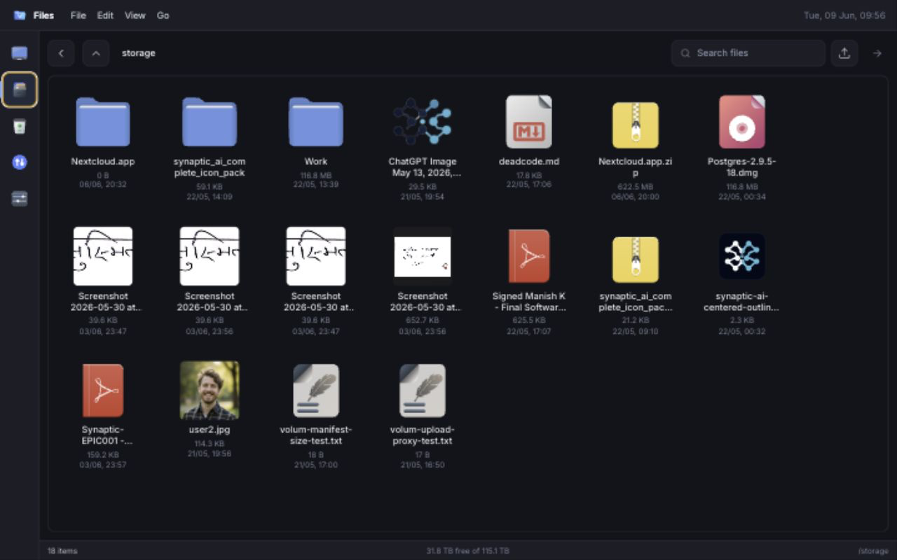
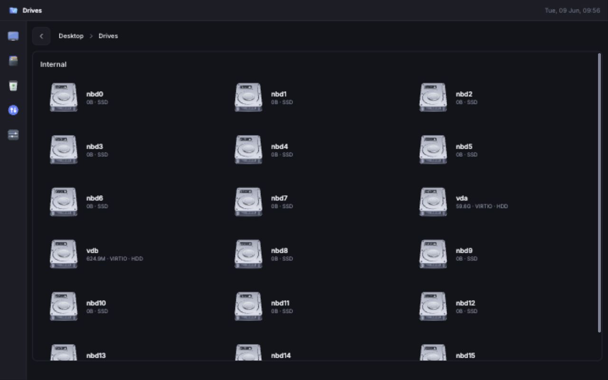
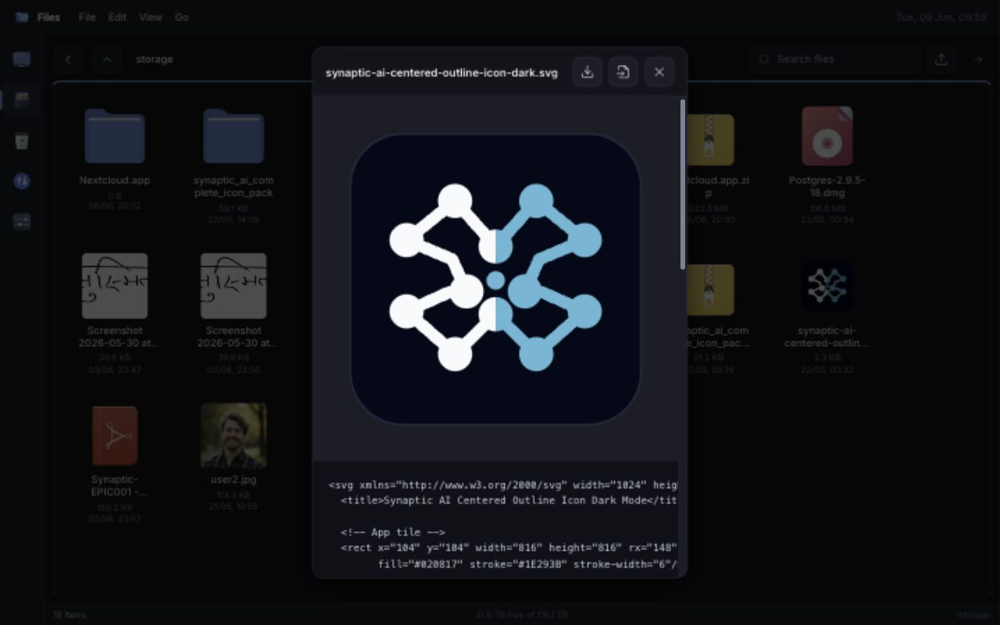
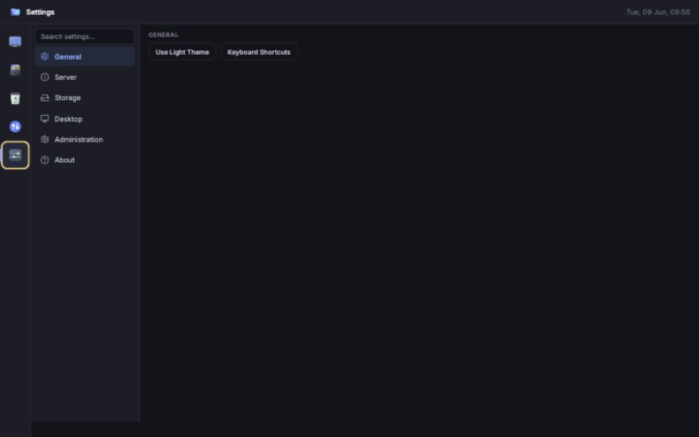
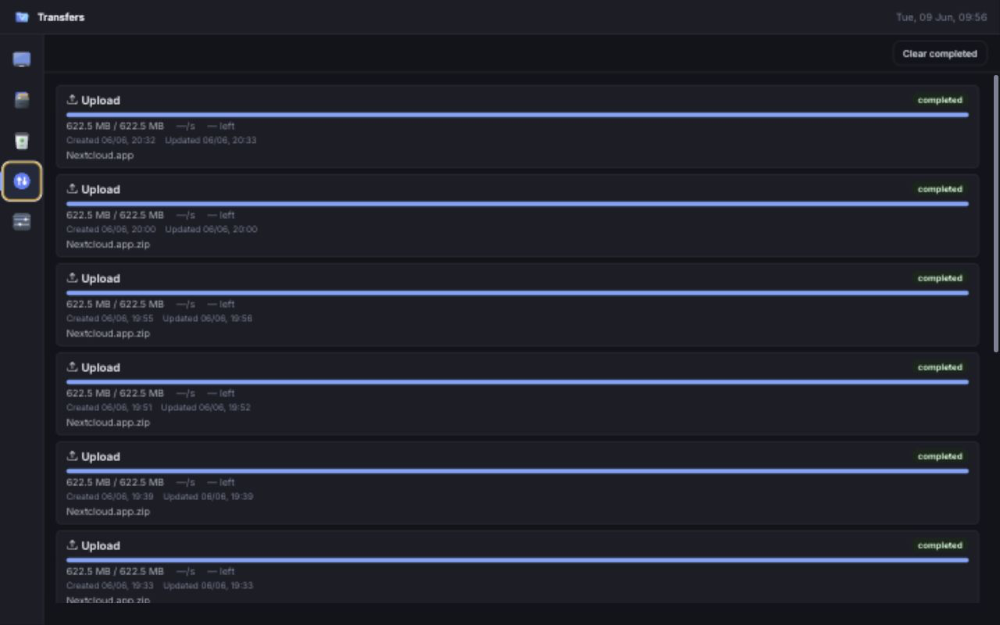

# Volum Desktop

[](LICENSE)
[](backend/go.mod)

Volum Desktop is a self-hosted web file manager for Ubuntu and Docker home servers. It is designed around a reliable backend job engine so long-running filesystem operations (copy, move, delete, archive, upload) can continue on the server even if the browser window is closed.

## Features

- **Desktop view** — GNOME Nautilus-style desktop with Drives, Trash, Settings, Transfers, Files, favorite folder shortcuts, customizable wallpaper/background, and draggable icon reordering
- **File browsing** — Grid and list views with sorting, hidden file toggle, per-folder view preferences
- **File actions** — Create folder, rename, batch rename, copy, move, trash with restore, permanent delete
- **Background jobs** — Persistent SQLite-backed jobs with real-time SSE progress, cancel, retry (including per-item retry), pause/resume
- **Upload & download** — Upload with size verification, single-file download, streamed directory zip download
- **Archives** — Create and extract zip, tar, tar.gz
- **Metadata** — Info panel, permissions editor (chmod rwx toggles), checksums (md5/sha256), folder size and disk usage analyzer
- **Search** — Global search across all roots with content grep
- **Sharing** — Create expiring share links with optional password and download limits; full share management UI with list and revoke
- **UX** — Top bar with clock and app menu (File/Edit/View/Go), status bar (item counts, storage info, path), context menus, keyboard shortcuts overlay, rubber-band drag select, touch long-press on mobile, dark mode, loading skeletons, action toasts with undo, browser notifications
- **Auth** — Admin and readonly session-cookie auth with HMAC-signed cookies
- **Safety** — Copy via `.partial` temp files with size verification, safe move (copy+verify+delete), per-root `.volum-trash/` recycle bin, configurable conflict policies (ask, skip, overwrite, rename, cancel)

## Screenshots

| Desktop view | File grid | Drives view |
|---|---|---|
|  |  |  |

| Preview modal | Settings | Transfers |
|---|---|---|
|  |  |  |

*Refresh screenshots from the running app when UI changes.*

## Quick Start — Home Server

1. Create a directory for Volum data and clone the repo:
   ```sh
   mkdir -p /opt/docker/volum/data /opt/docker/volum/storage
   git clone https://github.com/shirishkoirala/volum /opt/docker/volum
   cd /opt/docker/volum
   ```

2. Create `.env`:
   ```env
   VOLUM_SESSION_SECRET=$(openssl rand -base64 32)
   VOLUM_AUTH_REQUIRED=true
   VOLUM_ROOTS=/mnt/storage,/mnt/data,/opt/docker
   VOLUM_DB=/opt/docker/volum/data/volum.db
   VOLUM_PUBLIC_URL=https://volum.yourdomain.com
   ```

3. Start Volum:
   ```sh
   docker compose up --build -d
   ```

4. Open `http://your-server-ip:8090` and log in with the admin password.

For full server mode with host `/` access and automatic mounted-drive discovery, use `docker-compose.server.yml`:
```sh
docker compose -f docker-compose.server.yml up --build -d
```

## Development

Docker development (Vite hot reload — preferred):
```sh
docker compose -f docker-compose.dev.yml up --build
```

Backend (direct):
```sh
cd backend
go run ./cmd/volum
```

Frontend (direct):
```sh
cd frontend
npm install
npm run dev
```

Before committing, run:
```sh
cd frontend
npm run typecheck    # tsc --noEmit
npm run lint         # eslint .
npm run build        # tsc && vite build
```

## Architecture

### Backend (`backend/`)

Go 1.23 + chi router v5 + SQLite (via mattn/go-sqlite3). Monolithic files have been split into focused packages:

| Package | Files | Purpose |
|---------|-------|---------|
| `cmd/volum/` | `main.go` | Entry point |
| `internal/api/` | 9 files (`server.go`, `handlers_*.go`, `middleware.go`) | HTTP routes, handlers, auth middleware |
| `internal/files/` | 5 files (`service.go`, `service_trash.go`, `service_disk.go`, `cache.go`) | File listing, trash, disk usage |
| `internal/jobs/` | 7 files (`store.go`, `store_claiming.go`, `store_items.go`, `store_audit.go`, `store_maintenance.go`, `model.go`) | SQLite-backed job engine |
| `internal/auth/` | HMAC-signed session cookies, admin/readonly roles |
| `internal/shares/` | Expiring share link CRUD |
| `internal/storage/` | DB open + schema migration |
| `internal/worker/` | Background job orchestrator, polling loop |
| `internal/security/` | `RootGuard` path validation |
| `internal/config/` | Config parsing, mount discovery |

Testing: 10+ test files across all packages. `go vet ./...` + `go test ./...` run on every Docker build.

### Frontend (`frontend/`)

React 19 + Vite 6 + TypeScript with strict options (`noUncheckedIndexedAccess`, `noUnusedLocals`). CSS Modules with Vite auto-hashing.

```
frontend/src/
├── App.tsx                       # Thin routing shell (~50 lines): theme, auth, ErrorBoundary
├── screens/
│   ├── Home.tsx                  # Workspace shell: state, effects, handlers, view routing (~1112 lines)
│   └── LoginScreen.tsx
├── hooks/                        # Custom hooks (never define logic inline)
│   ├── useJobs.ts                # SSE job subscription + control handlers
│   ├── useDragDrop.ts            # Drag/drop state for transfers
│   ├── useRubberBand.ts          # Rubber-band selection
│   ├── useViewPreferences.ts     # View mode, sort, folder prefs + localStorage
│   ├── useNavigation.ts          # showingTrash, showingSettings, etc.
│   ├── useFavorites.ts           # Desktop folder shortcuts + localStorage
│   ├── useWallpaper.ts           # Wallpaper config + localStorage
│   ├── useFileActions.ts         # Preview, info, rename, search, context menu state
│   ├── useDialogStack.ts         # Confirm, text input, transfer dialogs
│   └── useLocalStorage.ts        # Generic localStorage hook
├── pages/                        # Full-page views
│   ├── DesktopView.tsx           # Desktop with drive icons, wallpaper, drag ordering
│   ├── FilesView.tsx             # File grid/list/column browsing
│   ├── TrashView.tsx             # Trash list (no selection toolbar)
│   ├── JobsPage.tsx              # Transfer history (no filter tabs)
│   └── SettingsPanel.tsx         # Settings with sidebar nav (6 categories)
├── components/
│   ├── input/                    # FolderPicker, Select, BatchRenameModal
│   ├── layout/                   # TopBar (brand + clock), AppMenuBar, BreadcrumbBar, Dock, StatusBar
│   ├── overlay/                  # Dialogs, Toast, InfoPanel, PreviewModal, ShareDialog, ShareManager,
│   │                             # DiskUsageAnalyzer, KeyboardShortcuts, ContextMenus (File/Trash/Desktop)
│   └── ui/                       # EmptyState, ProgressBar, Icon, WallpaperPicker, ServerInfo, GridTile,
│                                 # FileGridView/ListView/ColumnView, FileSearchBar, DriveSection
├── utils/                        # format.ts, path.ts, archive.ts, jobs.ts, view.ts, preview.ts, wallpaper.ts
├── types/                        # Shared TypeScript types
├── styles/                       # global.css (utility classes), tokens.css (theme vars)
└── api/                          # client.ts (typed fetch wrappers), icons.ts (SVG URL functions)
```

## Environment

```txt
VOLUM_HOME=/home/username            # Home directory for "My PC" Home icon
VOLUM_ROOTS=/mnt/storage,/mnt/data1  # Comma-separated paths to expose
VOLUM_INCLUDE_ROOT=false             # Expose host / in server mode
VOLUM_DISCOVER_ROOTS=false           # Auto-discover mounted drives
VOLUM_HOST_ROOT=                     # Docker server mode: host mount target
VOLUM_DB=/data/volum.db              # SQLite database path
VOLUM_PORT=8090                      # HTTP listen port
VOLUM_AUTH_REQUIRED=false            # Enable authentication
VOLUM_SESSION_SECRET=replace-with... # HMAC session signing key
VOLUM_PUBLIC_URL=                    # Public URL for share links
```

Authentication is controlled by `VOLUM_AUTH_REQUIRED`. When it is true, set a long random `VOLUM_SESSION_SECRET`; the first admin user is created from the setup screen.

## Docker Compose

Three compose files are provided:

| File | Use case |
|------|----------|
| `docker-compose.yml` | Base compose config (shared between dev and server) |
| `docker-compose.dev.yml` | Development with Vite hot reload, separate API + frontend containers |
| `docker-compose.server.yml` | Production server: mounts host `/` → `/host`, auto-discovers drives |

All env vars are configured through `.env` (see `.env.example`).

## Deployment

```sh
docker compose up --build -d
```

For homelab use, expose Volum only over a private network such as Tailscale or WireGuard. Avoid publishing it directly to the public internet.

For reverse proxy configuration with Nginx or Traefik, see [docs/reverse-proxy.md](docs/reverse-proxy.md).
