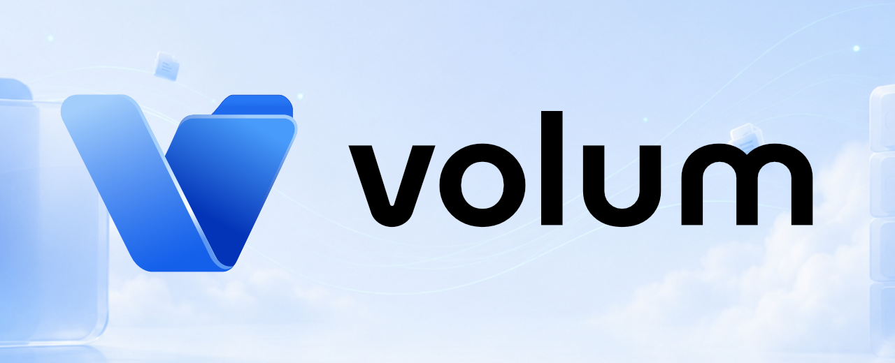
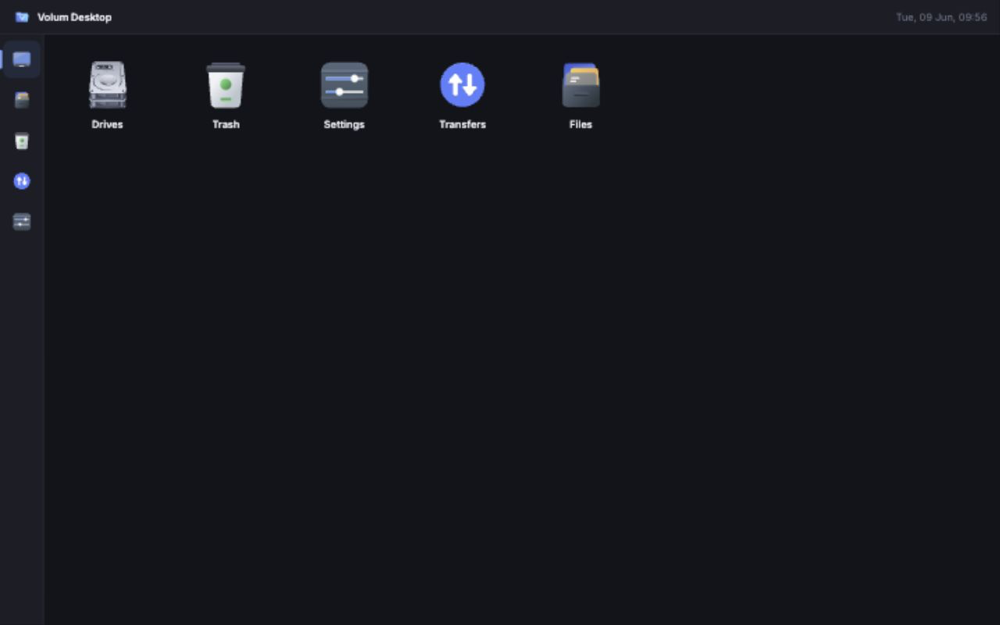

<p align="center">
  
</p>

# Volum - Your Server Files, Organized

<p align="center">
  A self-hosted desktop-style file manager for home servers and Docker hosts.
</p>

<p align="center">
  <a href="LICENSE">License</a> |
  <a href="docs/roadmap.md">Roadmap</a> |
  <a href="docs/reverse-proxy.md">Reverse Proxy</a> |
  <a href="docs/release.md">Release</a> |
  <a href="CONTRIBUTING.md">Contributing</a> |
  <a href="SUPPORT.md">Support</a>
</p>

<p align="center">
  
</p>

## Why Volum?

Volum is built for people who keep important files on their own server and want
a clean browser UI that still behaves like a real file manager.

Long-running work such as copy, move, upload, archive, extract, checksum, trash,
and restore runs on the server through persistent jobs. The browser can close
without losing the operation.

## Features

- **Desktop workspace** - Files, Drives, Trash, Transfers, Settings, and pinned
  folder shortcuts in a familiar desktop surface.
- **Reliable file operations** - background jobs with progress, cancel, retry,
  pause, resume, and conflict handling.
- **Safe storage behavior** - root-guarded paths, verified uploads, trash
  restore, and copy-verify-delete moves.
- **Preview and search** - image, media, PDF, and text previews with safe size
  limits; search across roots and act on results.
- **Sharing** - expiring share links with optional password and download limits.
- **Homelab friendly** - Docker deployment, auth, reverse proxy support, dark
  mode, mobile touch support, keyboard shortcuts, and service shortcuts.

## Getting Started

Clone the repo and create a server environment file:

```sh
git clone https://github.com/shirishkoirala/volum
cd volum
cp .env.server.example .env
sed -i.bak "s|^VOLUM_SESSION_SECRET=.*|VOLUM_SESSION_SECRET=$(openssl rand -base64 32)|" .env
```

Edit `.env` for your storage roots, database path, public URL, authentication,
and runtime user. For released images, set the compose service image to:

```yaml
image: ghcr.io/shirishkoirala/volum:latest
```

Then start the server compose stack:

```sh
docker compose -f docker-compose.server.yml up --build -d
```

Common production values:

```env
VOLUM_AUTH_REQUIRED=true
VOLUM_SESSION_SECRET=replace-with-a-long-random-secret
VOLUM_ROOTS=/mnt/storage,/mnt/media,/opt/docker
VOLUM_DB=/data/volum.db
VOLUM_PUBLIC_URL=https://volum.example.com
VOLUM_HOST_PATH=./storage
VOLUM_BIND_ADDRESS=127.0.0.1
```

When auth is enabled, create the first admin account from the setup screen using
`VOLUM_BOOTSTRAP_TOKEN`, or the generated token written to
`volum-initial-setup-token` beside the configured database. The server log
prints the token file path, not the token value.
Authentication is required by default when `VOLUM_AUTH_REQUIRED` is unset.
Disabling it requires `VOLUM_AUTH_REQUIRED=false` and the explicit local-only
opt-in `VOLUM_ALLOW_INSECURE_AUTH_DISABLED=true`.

## Deployment

Volum is meant for trusted private infrastructure: a home server, NAS-style
Docker host, or private lab network. Prefer Tailscale, WireGuard, or a reverse
proxy with auth enabled.

Full host filesystem access is explicit. Use it only on a trusted,
access-controlled machine:

```sh
VOLUM_HOST_PATH=/ VOLUM_UID=0 VOLUM_GID=0 docker compose -f docker-compose.server.yml up --build -d
```

Reverse proxy examples are in [docs/reverse-proxy.md](docs/reverse-proxy.md).
Release and Docker image publishing notes are in [docs/release.md](docs/release.md).

## Development

Development and contribution notes live in [CONTRIBUTING.md](CONTRIBUTING.md).
Planned onboarding and repository improvements are tracked in the
[contributor experience roadmap](docs/contributor-experience-roadmap.md).

Preferred dev server:

```sh
docker compose -f docker-compose.dev.yml up --build
```

## License

Volum is released under the [MIT License](LICENSE).
