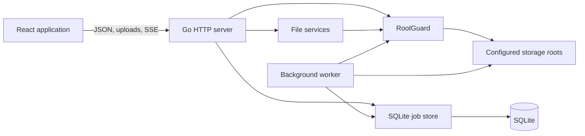
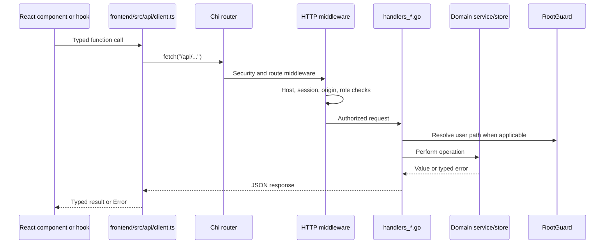
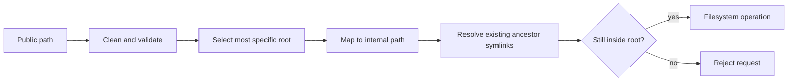
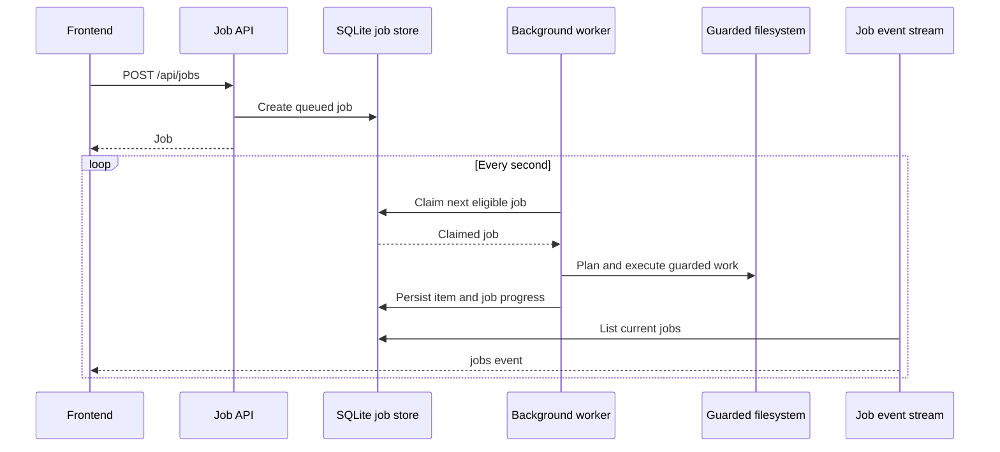

# Volum Architecture

This document explains how the current code fits together. It is intended for
contributors deciding where a change belongs and which safety boundaries must
remain intact.

## Runtime Shape



The production image serves the built React application and Go API from one
container. The development stack runs Vite separately and proxies `/api` and
`/healthz` to the API container.

## Startup

The process starts in `backend/cmd/volum/main.go`.

1. `config.Load()` reads and validates environment configuration.
2. `security.NewRootGuardWithRoots()` builds the public-to-internal root map.
3. `storage.Open()` opens SQLite, enables foreign keys and a busy timeout,
   limits the pool to one connection, and applies migrations.
4. Job, auth, file, share, and desktop stores/services are constructed.
5. Initial admin setup state and the bootstrap token are resolved.
6. Interrupted jobs are recovered, then the worker starts.
7. The service health checker starts.
8. `api.New()` creates the router and registers routes.
9. Allowed hosts and the public URL are configured.
10. The HTTP server starts and shuts down through the process signal context.

Startup errors are fatal. Background components share the cancellation context
so shutdown stops polling before the database closes.

## Frontend Startup

`frontend/src/App.tsx` is the frontend entry shell:

1. Fetch `/api/session`.
2. Show `SetupScreen` when the first admin must be created.
3. Show `LoginScreen` when authentication is enabled and no user is signed in.
4. Render `Home` inside `WindowManagerProvider` for an authenticated session.

`Home` composes workspace state and domain hooks. Reusable stateful behavior
belongs in `frontend/src/hooks/`; pure transformations belong in
`frontend/src/utils/`.

## HTTP Request Lifecycle



### Global middleware

`backend/internal/api/server.go` installs:

- Request IDs
- Request logging
- Panic recovery
- Security headers and allowed-host validation

### Protected route middleware

Routes under `/api` opt into middleware groups:

- `requireUser` loads the signed session and adds the user to the context.
- `requireAPIRequest` protects state-changing requests with the
  `X-Volum-Request: fetch` header and same-host `Origin` validation.
- `requireAdmin` blocks readonly users from mutations and administrative work.

The frontend request helper adds `X-Volum-Request` to unsafe methods. Upload
functions that call `fetch` directly must add it themselves.

Do not weaken middleware to solve a proxy problem. Preserve browser-origin
validation through the proxy instead.

### Error mapping

Handlers should pass domain errors to `writeError()` when possible. It maps
known validation, conflict, permission, missing-file, and unsupported-operation
errors to stable HTTP statuses. Unexpected errors become HTTP 500 responses.

## Path Safety

`backend/internal/security/paths.go` owns the filesystem trust boundary.

A browser sends a public path such as `/storage/photos`. `RootGuard.Resolve()`
maps it to an internal path, chooses the most specific configured root, and
evaluates symlinks on the nearest existing ancestor. A path is rejected if it
escapes the internal root.



Rules for contributors:

- Resolve every user-supplied filesystem path through `RootGuard`.
- Use guarded mutation methods rather than raw `os` mutations.
- Do not trust a path because an earlier UI step validated it.
- Do not follow symlinks for raw file reads unless the operation explicitly
  allows it.
- Do not operate on a configured root itself when the domain forbids it.
- Test paths outside roots and symlinks pointing outside roots.

## File Listing

File-list requests are registered in `server.go` and implemented in
`handlers_files.go`.

1. The handler reads paging and path parameters.
2. The file service resolves the path through `RootGuard`.
3. Directory entries are sorted before expensive metadata is loaded.
4. Metadata is loaded only for the requested page.
5. The API returns entries plus paging information.
6. Frontend file-browser hooks append later pages as the user scrolls.

Keep filesystem behavior in `backend/internal/files/`; handlers should remain
responsible for HTTP parsing and response mapping.

## Background Jobs

Copy, move, archive, extract, and checksum operations use the SQLite job store
and background worker.



`backend/internal/jobs/` owns persistence and state transitions.
`backend/internal/worker/` owns filesystem execution.

The worker:

- Recovers interrupted running jobs at startup.
- Polls every second.
- Claims at most one transfer, archive/extract, or checksum job per pass.
- Persists job items before copying.
- Checks cancellation and pause state during work.
- Uses partial paths and verification before finalizing destinations.
- Leaves `ask` conflicts in `needs_attention` for user resolution.
- Completes a move by deleting the source only after copy work succeeds.

New job behavior normally touches:

- `backend/internal/jobs/model.go`
- `backend/internal/jobs/store_claiming.go`
- The relevant worker file
- `backend/internal/api/handlers_jobs.go`
- `frontend/src/api/client.ts`
- `frontend/src/hooks/useJobs.ts` or the initiating UI
- Backend and frontend tests

## Upload Lifecycle

Uploads are represented as jobs for progress and history, but upload bytes are
handled by API requests rather than claimed by the background worker.

The frontend uses one MiB chunks:

1. `getUploadStatus()` asks how many bytes are already present.
2. `uploadFileWithResume()` slices the browser `File`.
3. `uploadChunk()` sends each chunk with path, filename, offset, total size,
   optional job ID, and the CSRF request header.
4. The handler validates the target directory and filename.
5. The destination and temporary path are resolved through `RootGuard`.
6. Bytes are appended to a `.partial` file and progress is persisted.
7. Final size is verified before the destination is finalized.
8. Error paths fail the job and clean partial state.

Upload changes must cover:

- Invalid names and traversal attempts
- Existing-destination conflict policies
- Wrong offsets and total sizes
- Cancellation and pause state
- Resume after interruption
- Partial-file and job-ID cleanup
- Reverse proxies and configured public subpaths

## Server-Sent Events

`GET /api/jobs/events` is an authenticated SSE stream.

- The server sends a full job list immediately and every second.
- Health transitions are sent on the same stream as `health` events.
- `frontend/src/hooks/useJobs.ts` replaces job state from each jobs event.
- Completed filesystem jobs trigger a file refresh.
- Job completion/failure and service transitions can produce notifications.
- Browser `EventSource` reconnect behavior handles a dropped stream.

Because the stream sends complete job lists, changes should avoid adding large
unbounded fields to job responses.

## SQLite and Migrations

`backend/internal/storage/sqlite.go` owns schema setup.

- SQLite runs with `_busy_timeout=5000` and foreign keys enabled.
- The process uses one open database connection to avoid lock contention.
- `initialSchema` creates baseline tables and indexes.
- `addColumnIfMissing()` applies additive upgrades for older databases.
- Stores receive `*sql.DB`; handlers should not contain raw schema logic.

Migration rules:

- Upgrades must be idempotent.
- Preserve existing user data.
- Test both a new database and an older schema upgraded in place.
- Wrap multi-statement state changes in transactions.
- Do not silently ignore migration errors other than the expected
  already-exists case.

## Testing Boundaries

Backend tests use `t.TempDir()` for files and SQLite databases. API tests use
`httptest`; they should exercise middleware and response behavior as well as
the happy path.

Frontend tests use Vitest, jsdom, Testing Library, and `userEvent`. Prefer
accessible queries and observable behavior.

Use the root command surface:

```sh
make test-frontend
make test-backend
make check
make smoke
make smoke-proxy
```

## Where Changes Belong

| Change | Primary location |
|---|---|
| Route or HTTP request/response | `backend/internal/api/` |
| Path validation or guarded mutation | `backend/internal/security/` |
| Listing, trash, search, disk usage | `backend/internal/files/` |
| Job state or persistence | `backend/internal/jobs/` |
| Long-running filesystem execution | `backend/internal/worker/` |
| Users, sessions, roles | `backend/internal/auth/` |
| Schema and migrations | `backend/internal/storage/` |
| Typed browser API calls | `frontend/src/api/` |
| Stateful reusable UI behavior | `frontend/src/hooks/` |
| Pure reusable logic | `frontend/src/utils/` |
| Full workspace content | `frontend/src/pages/` |
| Login/setup/application shells | `frontend/src/screens/` |
| Reusable UI | `frontend/src/components/` |

See the [change guides](change-guides/README.md) for task-oriented checklists.
Definitions of project-specific terms are in the [glossary](glossary.md).
Cross-cutting constraints are recorded in
[architecture decision records](adr/README.md).
